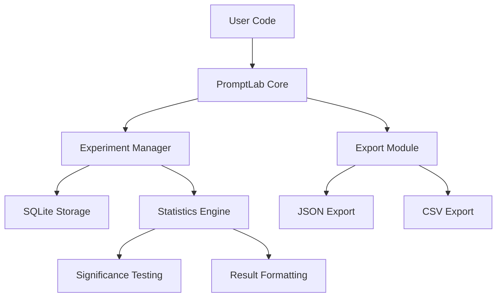

# PromptLab

[](https://github.com/officethree/PromptLab/actions/workflows/ci.yml)
[](https://www.python.org/downloads/)
[](LICENSE)
[](https://pypi.org/project/promptlab/)

**Prompt experimentation workspace** -- A Python library for running A/B tests on prompt variations, tracking results, and finding optimal prompts.

---

## Architecture



## Quickstart

### Installation

```bash
pip install promptlab
```

Or install from source:

```bash
git clone https://github.com/officethree/PromptLab.git
cd PromptLab
pip install -e ".[dev]"
```

### Basic Usage

```python
from promptlab import PromptLab

lab = PromptLab()

# Create an experiment with prompt variants
exp = lab.create_experiment("tone-test", variants=[
    "Write a professional email about {topic}",
    "Write a friendly email about {topic}",
    "Write a concise email about {topic}",
])

# Record trial results (e.g., from human evaluation or LLM-as-judge)
lab.run_trial(exp, variant=0, result_score=0.85)
lab.run_trial(exp, variant=0, result_score=0.78)
lab.run_trial(exp, variant=1, result_score=0.92)
lab.run_trial(exp, variant=1, result_score=0.88)
lab.run_trial(exp, variant=2, result_score=0.70)
lab.run_trial(exp, variant=2, result_score=0.65)

# Analyze results
results = lab.get_results(exp)
print(results)

# Find the best-performing variant
winner = lab.get_winner(exp)
print(f"Winner: variant {winner['variant']} with mean score {winner['mean_score']:.3f}")

# Check statistical significance
sig = lab.statistical_significance(exp)
print(f"Significant difference: {sig['is_significant']} (p={sig['p_value']:.4f})")

# Compare all variants head-to-head
comparison = lab.compare_variants(exp)
for pair in comparison:
    print(f"  {pair['variant_a']} vs {pair['variant_b']}: p={pair['p_value']:.4f}")

# Export results
lab.export(exp, format="json", path="results.json")
lab.export(exp, format="csv", path="results.csv")
```

### Experiment History

```python
# View all experiments
history = lab.get_history()
for entry in history:
    print(f"{entry['name']} -- {entry['num_variants']} variants, {entry['total_trials']} trials")
```

## Configuration

Set options via environment variables or pass them directly:

```python
lab = PromptLab(db_path="my_experiments.db", significance_level=0.01)
```

| Variable | Default | Description |
|---|---|---|
| `PROMPTLAB_DB_PATH` | `promptlab.db` | SQLite database file path |
| `PROMPTLAB_SIGNIFICANCE_LEVEL` | `0.05` | p-value threshold for significance |

## Development

```bash
make install    # Install with dev dependencies
make test       # Run tests
make lint       # Run linter
make format     # Format code
make all        # Run all checks
```

## Contributing

See [CONTRIBUTING.md](CONTRIBUTING.md) for guidelines.

---

*Inspired by prompt engineering and experimentation trends.*

---

**Built by [Officethree Technologies](https://officethree.com) | Made with love and AI**
