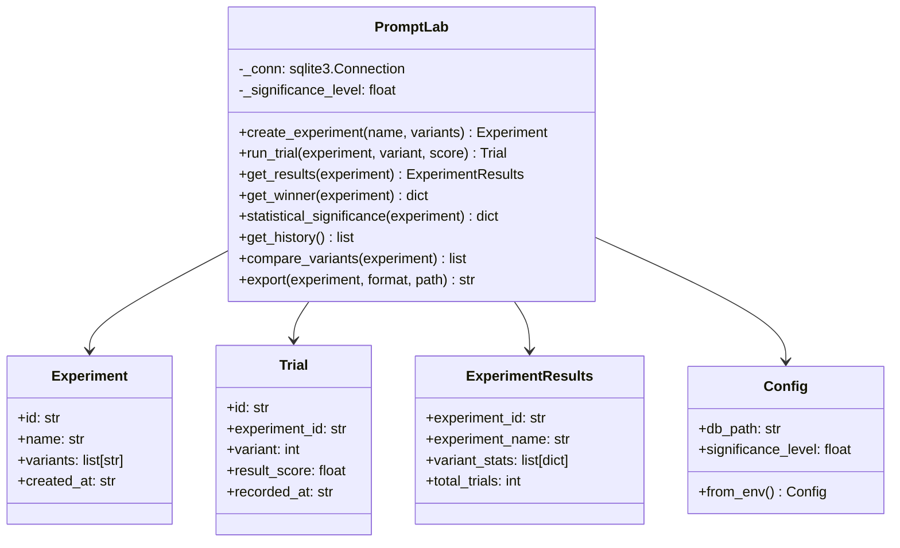

# Architecture

## Overview

PromptLab is a Python library for running A/B tests on prompt variations. It uses SQLite for persistent trial storage, Pydantic for data validation, and pure-Python statistical tests for significance analysis.

## Module Map

```
src/promptlab/
├── __init__.py      # Public API re-exports
├── core.py          # PromptLab class, Pydantic models, experiment logic
├── config.py        # Runtime configuration (env-based, Pydantic)
└── utils.py         # Statistics helpers, significance testing, formatting
```

## Core Components



## Data Flow

1. **Create** -- Define an experiment with named prompt variants.
2. **Trial** -- Record scores from evaluation (human, LLM-as-judge, or automated).
3. **Analyse** -- Compute per-variant statistics and run significance tests.
4. **Compare** -- Pairwise Welch t-tests between variants.
5. **Export** -- Serialise results to JSON or CSV for external analysis.

## Storage

All experiment and trial data is stored in a SQLite database with two tables:

- `experiments` -- experiment metadata and variant definitions (JSON-serialised).
- `trials` -- individual trial scores linked to experiments by foreign key.

## Statistics

PromptLab implements significance testing without external dependencies:

- **One-way ANOVA F-test** for overall multi-variant comparison.
- **Welch's t-test** for pairwise variant comparison.
- **Regularised incomplete beta function** for computing p-values from F and t distributions.

## Design Decisions

- **Pure Python stats** -- No scipy dependency keeps installation lightweight.
- **SQLite storage** -- Zero-config persistence; works with in-memory databases for testing.
- **Pydantic models** -- Typed, validated data structures for experiments, trials, and configs.
- **Context manager support** -- `PromptLab` can be used with `with` statements for clean resource management.
